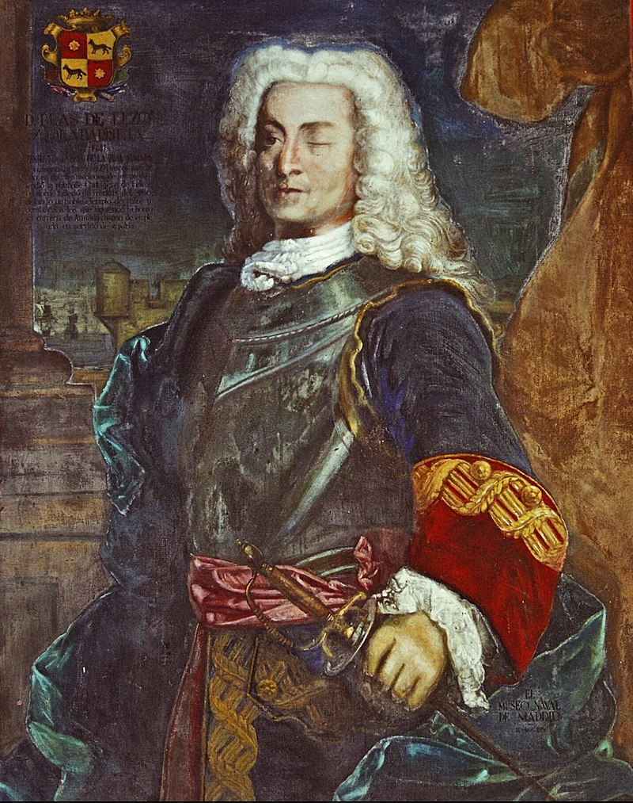

## **HUNDIR LA FLOTA AMBIENTADO EN BLAS DE LEZO**
> **Grupo 4**, conformado por: Alba María Romero, Fernando Manzano, Pedro Pérez y Pepe Reina.
>> Decidimos ambientar nuestro juego en [Blas de lezo](https://es.wikipedia.org/wiki/Blas_de_Lezo). Para ello, el juego inicia con una pequeña presentación del personaje, en la que Blas pide que introduzcas tu nombre.  
  
*IMAGEN DE LA ENTRADA EN WIKIPEDIA .*

## OK, MUY INTERESANTE, LO SÉ... PERO HABLEMOS DE CÓMO HEMOS LLEGADO AL RESULTADO FINAL.

Tuvimos diferentes "líneas de pensamiento", es decir, diferentes aproximaciones sobre cómo abordar el proyecto. Intentamos mostrar ambos tableros, el del jugador y el del enemigo, en los cuales la estética y lo visual eran lo primordial, utilizando para ello un código bastante largo y que resultaba bastante engorroso de "orientarlo a objetos". Otra de las opciones que probamos fue el uso de matrices tridimensionales, lo cual, aunque funcional, no era fácil de comprender, por lo que optamos por el camino del medio.

## EN CUANTO A LA JUGABILIDAD...

Tras introducir el nombre del jugador se crean los tableros y se muestran. En un primer momento se imprimen los barcos del enemigo, solo para mostrar que su disposición es aleatoria y que no siempre ocupan las mismas coordenadas. Obviamente, para un juego justo, esto no debería ser así, pero un simple "#" basta para que este no aparezca impreso. Para jugar, la máquina nos irá pidiendo que introduzcamos coordenadas, separadas por coma y, obviamente, primero filas y después columnas, marcando dónde fue el tiro y si este fue al agua o a un barco enemigo, avisando también cuando hundimos un barco.

